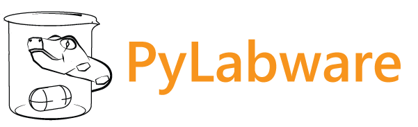

============

This is a simple Python 3 library to control the common range of the hardware found in the chemistry labs - hotplates, stirrers, rotary evaporators, vacuum pumps etc. using a common interface.

---

## Features
- Wide range of supported hardware
- Supports both serial/RS-232 and Ethernet connection to the devices.
- Provides thread-safe parallel execution of several commands per device.
- Provides single interface per device type irrespective of a particular manufacturer.
- Simulation mode to test your code before executing it with real hardware.
- Easy addition of new devices.

---

## Setup
Clone this repo to your PC and run `pip install .` from the repository folder.

---

## Usage

```
>>> import PyLabware as pl
>>> pump = pl.C3000SyringePump(device_name="reagent_pump", port="COM7",
    connection_mode="serial", address=None, switch_address=4)
>>> pump.connect()
>>> pump.initialize_device()
>>> pump.get_valve_position()
    'I'
>>> pump.withdraw(200)
>>> pump.set_valve_position("O")
>>> pump.dispense(200)
...
```
---

## License
This project is licensed under [MIT license](LICENSE).
© 2021 [Cronin group](http://croninlab.com)