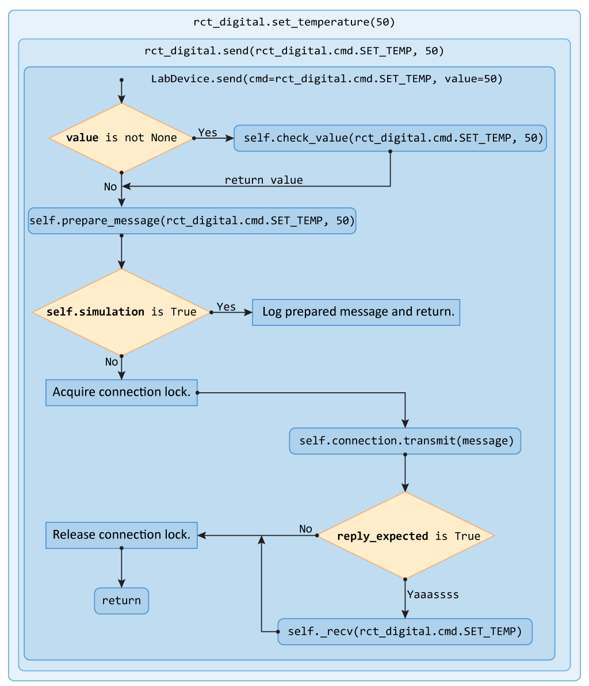
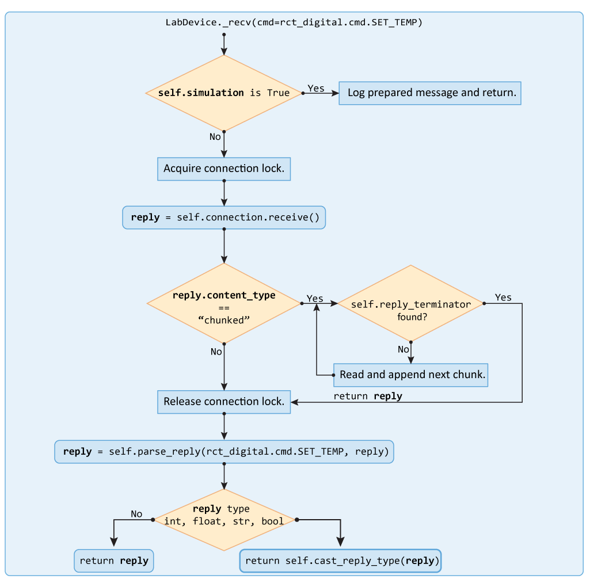

Data model
==========

Data flow
---------
The flow chart below shows the data flow from the host to the device using the
:py:meth:`set_temperature()` method for the
:doc:`IKA RCT Digital hotplate<src/devices.ika_rct_digital>`:

:py:meth:`~PyLabware.controllers.LabDevice._recv()` is usually called
automatically based on whether reply is expected from device according to the
command definition (see below). However, :py:meth:`_recv()` can be called
explicitly to acquire the data from underlying connection object. The data flow
inside :py:meth:`_recv()` is presented in the next flow chart:

.. _timeouts:

Timeouts
--------

There are several timeouts implemented to facilitate flow control and avoid
deadlocking on the connection level:

`command_delay`
    This is the delay between two sequential commands sent to ensure the device
    has enough time to process the first one before getting another one. This
    delay is maintained inside the repspective connection class
    :py:meth:`transmit()` method.
`receive_timeout`
    This is the delay for the underlying connection's :py:meth:`receive()` method.
`transmit_timeout`
    This is the delay for the underlying connection's :py:meth:`send()` method.
`receiving_interval`
    This is the delay for the connection listener loop to sleep between reading
    from the underlying connection object.

The default values for the timeouts can be found in the
:py:attr:`~PyLabware.connections.AbstractConnection.DEFAULT_CONNECTION_PARAMETERS`
dictionary of the :py:class:`AbstractConnection` class. They can be accessed and
overriden through the :py:attr:`LabDevice.connection` object::

    >>> LabDevice.connection.command_delay = 2 # Sets inter-command delay to 2 seconds

Device command structure
------------------------

Command set for every device is grouped into a helper class acting purely as a
command container. Each command definition is a simple Python dictionary.
The command dictionary contains all the necessary information related to any
particular command including:

* Argument value type.
* Allowed argument values range/set.
* Information whether a reply is expected after issuing the command.
* Rules for reply parsing.

Below is an example of command definitions with flattened dictionary structure
for visual compactness::

   class RCTDigitalHotplateCommands(LabDeviceCommands):
      """Collection of command definitions for for IKA RCT Digital stirring hotplate.
      """
      ...
      # Get internal hotplate sensor temperature
      GET_TEMP = {"name": "IN_PV_2", "reply": {"type": float, "parser": parser.slicer, "args": [-2]}}
      # Set temperature
      SET_TEMP = {"name": "OUT_SP_1", "type": int, "check": {"min": 20, "max": 310}}
      ...

The principal structure of the dictionary is as follows::

   cmd_name = {"name": "cmd_string",
               "type": None,
               "check": {},
               "reply": {}
               }

cmd_name
    A human-understandable command name used in function
    calls. Must be capitalized. Mandatory.
cmd_string
    An actual command sent to the device, according to device
    specs. Unused fields should be either assigned to `None` or skipped. Mandatory.
type
    One of the standard Python types that the command parameter has to be casted to
    before sending. Optional.
check
    A sub-dictionary defining command parameter checking rules (see below).
    Optional.
reply
    A sub-dictionary defining command reply handling (see below). Optional.

.. warning:: PyLabware check the presence of :py:attr:`reply` key in the command
             dictionary to judge whether a reply should be expected from the device
             after sending a command.

             As there is no universal way to map the reply to the preceding
             command, an unsolicited reply would be processed by PyLabware and
             given out next time :py:meth:`_recv()` is called, which would break
             the data flow.

             Thus, even if no reply is desired, but the device still sends it
             back, an empty ``reply: {}`` key should be included in the command
             definition.

The shortest command specification without any parameter value checking and
no reply expected would be::

   TEST_COMMAND = {"name":"T"}

The shortest command definition with reply expected would be::

   TEST_COMMAND = {"name":"T", "reply":{}}

Value checking
**************

There are two basic options for value checking: built in - min/max check and
value in range check. Custom workflows for value checking are not supported.

Min/max check
^^^^^^^^^^^^^

Example::

   SET_TEMP = {"name":"ST",
               "type":int,
               "check": {"min": 20,
                         "max": 180
                        }
               }

min
    Minimum allowed value for the command parameter.
max
    Maximum allowed value for the command parameter.

The example above defines a command with an ``integer`` argument having minimum
allowed value of ``20`` and maximum allowed value of ``180``. Upon invoking
:py:attr:`device.send(SET_TEMP, 52.5)`, the following would happen:

1. The value ``52.2`` would be cast to ``SET_TEMP["type"]``, being transformed to
   52.
2. A check ``is 52 > 20`` would be performed, if not,
   :py:meth:`SLDeviceCommandError` exception would be raised.
3. A check ``is 52 < 180`` would be performed, if not,
   :py:exc:`SLDeviceCommandError` exception would be raised.
4. The checked parameter would be glued together with the ``SET_TEMP["name"]`` along
   with the proper termination.
5. The resulting message (e.g. ``ST 52\r\n``) would be sent to the device after
   which :py:meth:`device.send()` would return as no reply is expected according to
   the command definition.

Value in range check
^^^^^^^^^^^^^^^^^^^^

Example::

   SET_ROTATION_DIR = {"name":"SRD",
               "type":str,
               "check": {"values": ["CW", "CCW", "cw", "ccw"]
                        }
               }

values
    Any iterable holding discrete values that the command parameter can take.

The execution flow for this command would be similar to the one above with the
min/max check being replaces by the ``parameter in values`` check.

Built-in reply parsers
**********************

As it was explained above, PyLabware checks for the presence of the :py:attr:`reply` key in
the command definition to figure out whether it should wait for the device reply
after sending a command. The contents of the :py:attr:`reply` define the further
processing of the obtained reply::

   GET_TEMP = {"name": "IN_PV_2",
               "reply": {"type": float,
                         "parser": parser.slicer,
                          "args": [-2]
                        }
               }

type
    One of the standard Python types that the reply would be cast to. Optional.

.. note:: To provide compatibility with more complex processing, type casting
          only takes place if the original reply type is one of the basic Python
          types - `int`, `float`, `str` or `bool`.

parser
    Any callable to pass the reply to for the further parsing. See the section
    on custom parsers below for the detailed description.

args
    A list of positional arguments to pass to the parser.

A few simple parsers that are used most often are provided in the
:py:mod:`PyLabware.parsers` module.

Making custom parsers
*********************

To make a custom parser when developing your own device driver,
simply define a function taking :py:attr:`reply` as a first argument::

    def my_parser(reply, dofourtytwo=0):
        if dofourtytwo == 42:
            return 42
        else:
            return reply

Then provide it as a parser in the command definition::

    MY_AWESOME_CMD = {cmd_name="DO", type: str, "reply":{"parser": my_parser, "args":[42]}}

Note the following:

* The absence of quotes around ``my_parser`` in the command definition -
  it has to be passed by reference, not by calling it.
* Even when we pass only a single argument, it still has to be passed as a list.

.. TODO:: Fix the latter - convert a single value to list intrinsically

Device reply structure
----------------------

.. autoclass:: PyLabware.models.LabDeviceReply
   :members:

content_type
    Content type is a literal defining how the reply body should be treated.
    Currently, only two types are supported - *text* for plain-text replies and
    *json* for JSON replies.
parameters
    Optional Python dictionary holding any required reply parameters.
body
    The reply body.

Abstract classes hierarchy
--------------------------

The abstract classes hierarchy is one of the core concepts in PyLabware. It ensures,
that all the devices are classified into a limited number of basic types,
according to their capabilities. Every device type provides a uniform set of
methods irrespective of the particular device's internal implementation.

This is maintained by a set of hierarchical abstract classes branching down from
Python's standard :py:class:`ABC`. Each abstract class presents a limited set of
basic abstract methods that **must** be implemented by all children along with
any additional methods to provide extra functionality.

.. autoclass:: PyLabware.models.AbstractLabDevice
   :members:
   :undoc-members:
   :show-inheritance:

.. autoclass:: PyLabware.controllers.AbstractTemperatureController
   :members:
   :undoc-members:
   :show-inheritance:

.. autoclass:: PyLabware.controllers.AbstractPressureController
   :members:
   :undoc-members:
   :show-inheritance:

.. autoclass:: PyLabware.controllers.AbstractStirringController
   :members:
   :undoc-members:
   :show-inheritance:

.. autoclass:: PyLabware.controllers.AbstractDispensingController
   :members:
   :undoc-members:
   :show-inheritance:

.. autoclass:: PyLabware.controllers.AbstractHotplate
   :members:
   :undoc-members:
   :show-inheritance:

.. autoclass:: PyLabware.controllers.AbstractSyringePump
   :members:
   :undoc-members:
   :show-inheritance:

.. autoclass:: PyLabware.controllers.AbstractDistributionValve
   :members:
   :undoc-members:
   :show-inheritance:

.. autoclass:: PyLabware.controllers.AbstractRotavap
   :members:
   :undoc-members:
   :show-inheritance:

.. autoclass:: PyLabware.controllers.AbstractFlashChromatographySystem
   :members:
   :undoc-members:
   :show-inheritance: